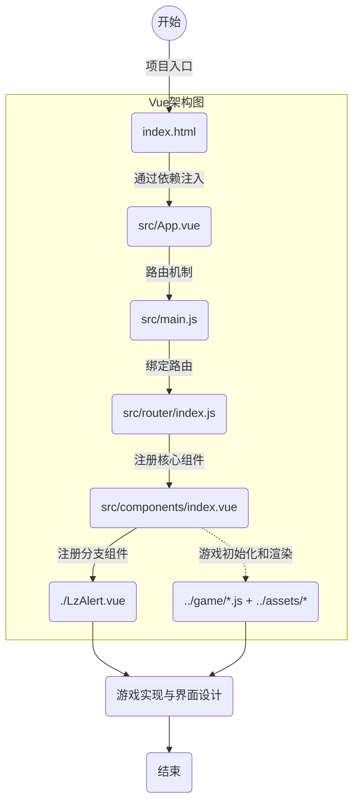

# Odyssey-China_chess

> A Vue.js project for demo, it is just a simple game like china chess, run dev and enjoy it!
>
> 基于Vue + Webpack的小型游戏开发之中国象棋

## Team Work

|           人员            |                 任务                 |
| :-----------------------: | :----------------------------------: |
| /// - 组长 | 前端设计与开发 + 版本控制 + 文档编写 |
|   ///    |  前端设计 + 游戏规则写入 + 文档编写  |
|   ///    |                                      |
|   ///    |                                      |
|   ///    |                                      |

## Project Directory

```s
|-- Odyssey_China-chess
    |-- index.html //项目静态入口
    |-- package-lock.json //模块版本控制
    |-- package.json //模块版本
    |-- README.md //项目说明
    |-- build //项目构建(webpack)相关代码
    |-- config //配置目录，包括端口号等
    |-- src //项目开发目录
    |   |-- App.vue //项目入口
    |   |-- main.js //项目核心文件
    |   |-- assets //组件静态资源
    |   |   |-- images //背景图片资源
    |   |   |   |-- board.png //棋盘背景图
    |   |   |   |-- ink.jpg //界面背景图
    |   |   |-- pairs //棋子图片资源
    |   |       |-- -1 //黑方棋子
    |   |       |   |-- j.png
    |   |       |   |-- k.png
    |   |       |   |-- m.png
    |   |       |   |-- p.png
    |   |       |   |-- s.png
    |   |       |   |-- x.png
    |   |       |   |-- z.png
    |   |       |-- 1 //红方棋子
    |   |           |-- j.png
    |   |           |-- k.png
    |   |           |-- m.png
    |   |           |-- p.png
    |   |           |-- s.png
    |   |           |-- x.png
    |   |           |-- z.png
    |   |-- components //公共组件目录
    |   |   |-- index.vue //核心组件
    |   |   |-- LzAlert.vue //弹窗组件
    |   |-- game //游戏配置目录
    |   |   |-- index.js //游戏初始化核心定义
    |   |   |-- pair.js //棋子移动定义
    |   |   |-- rule.js //象棋基础规则定义
    |   |-- router //引用路由目录
    |       |-- index.js //设置路由
    |-- static //静态资源目录
    |   |-- .gitkeep
    |   |-- index.ico //图标
    |   |-- music //音乐
    |       |-- lg.mp3
    |       |-- lyxt.mp3
    |       |-- mhbw.mp3
    |       |-- nhct.mp3
    |       |-- smmf.mp3
    |       |-- wcxf.mp3
    |-- test //测试目录
```

## Design Idea


## Front-End

>背景界面(App.vue): 调整合适宽高，选取与象棋及传统文化有关的水墨风格，从色彩及内容尽量贴合。
> 
>加载界面(index.vue): 整体居中，贴合背景，将画面分为三部分，以突出"开始游戏"的入口。
>
>游戏界面(index.vue): 棋盘居中而立，贴合背景，右侧实现功能框，以提供各种事件驱动的入口。
>
>游戏结束界面(index.vue): 居中覆盖整个界面，提供新游戏的入口，音乐结束，点击"再来一局"，回溯全部状态。
>
>暂停界面(index.vue): 居中覆盖整个界面，音乐暂停，重新点击后，恢复游戏和音乐。

## Build Setup

```bash
# install dependencies
npm install

# serve with hot reload at localhost:8080
npm run dev

# build for production with minification
npm run build

# build for production and view the bundle analyzer report
npm run build --report

# run unit tests
npm run unit

# run e2e tests
npm run e2e

# run all tests
npm test
```

For a detailed explanation on how things work, check out the [guide](http://vuejs-templates.github.io/webpack/) and [docs for vue-loader](http://vuejs.github.io/vue-loader).
